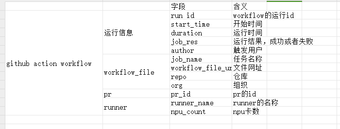
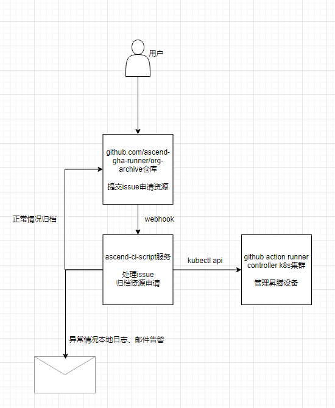
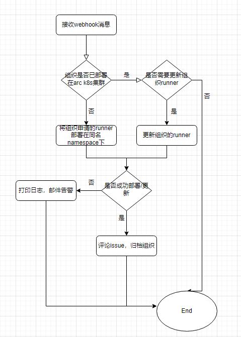
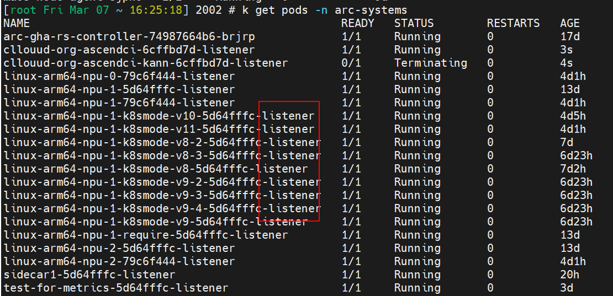

# 监控runners
记录 NPU runner 执行的CI信息，用于年度总结，合理分配NPU资源。

## metrics
1. 每个任务的运行情况:由谁触发，起止时间，组织仓库，`workflow url`和`action run id`,运行结果。
2. arc层面的总体指标：当前接入哪些组织/仓库。历史任务的数量，组织/仓库分布。历史任务的成功/失败比例。

## 实现方式
运维配置，将runner log存储到obs桶。
从obs桶获取runner log，解析并且存入mysql数据库。
字段：

# 后台自动化
## 场景图

## 流程图

# 告警
启动一个服务每五分钟一次调用KUBECTL API监听listener pod。
如果listener pod的status不为running则邮件告警。
如果listener pod都没问题则每天邮件通知。

